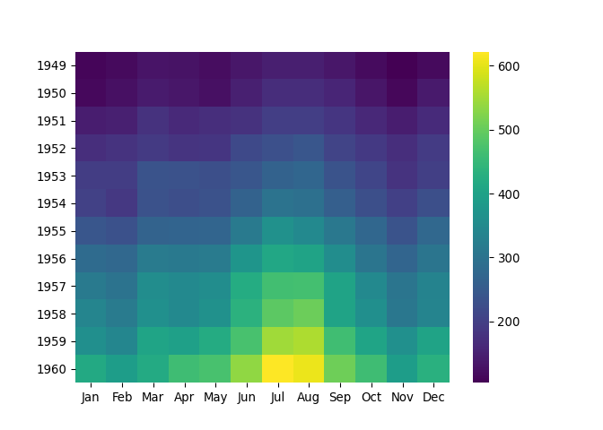
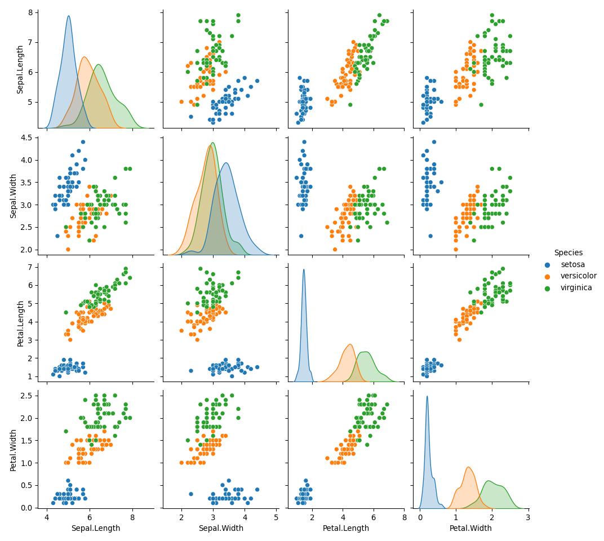

# How to use python in R
  
> By J. Eduardo Rodriguez Almaraz
------------------------------------
## Contents
  
- [Importing libraries](#Importing-libraries-using-R-syntax)
  
- [Getting the data](#Importing-the-dataset)
  
  
- [Creating the plots](#Creating-the-plots)
  * [heatmap](#Heatmap)
  * [Pair Plots](#Pair-plots)
  
- [Manipulating Data](#Extra-quick-examples-to-manipulate-R-to-Python-to-R-data)
  * [Python to R](#Python-to-R)
  * [R to Python](#R-to-Python)


``` r
knitr::opts_chunk$set(echo = TRUE)
library(reticulate)
```

To see the output of this code with tables and figures see the [HTML
file](https://github.com/eduardorod1229/Notes-and-tutorials/blob/master/How-to-use-python-in-R.md)

## Importing libraries using R syntax

  - For this to work you need to download and install the `reticulate`
    library using `install.packages('reticulate')` and either
    [miniconda](https://docs.conda.io/en/latest/miniconda.html) or
    [anaconda](https://www.anaconda.com) software With the following
    code you can import the python libraries as “R objects” which will
    appear in the **environment** section of R studio so for an RMarkdow
    you need to include the `'''{R}` syntax

Additionally, you have to install the *python* libraries in *R* before
using them. you can do this by typing `py_install([name of library])` in
the console. You only have to do this once. If this doesn’t work be sure
to specify your path in the set up of the RMarkdown document

``` r
sns<- import('seaborn')
plt<- import('matplotlib.pyplot')
pd <- import('pandas')
```

If the libraries are correctly imported then they will shouw up in the
*Global environment* pane as *“Modules”*

## Importing the dataset

Before manipulating anything we need a dataset, of course,In this case
we will use the system’s `AirPassengers` dataset. Note that we are using
R syntax to create this initial dataset and later we’ll go over on how
to interact with in in *Python*.

``` r
df <- datasets::AirPassengers
df1<-data.frame(tapply(df, list(year= floor(time(df)), month = month.abb[cycle(df)]),c))
df1<- df1[month.abb]
df1
```

    ##      Jan Feb Mar Apr May Jun Jul Aug Sep Oct Nov Dec
    ## 1949 112 118 132 129 121 135 148 148 136 119 104 118
    ## 1950 115 126 141 135 125 149 170 170 158 133 114 140
    ## 1951 145 150 178 163 172 178 199 199 184 162 146 166
    ## 1952 171 180 193 181 183 218 230 242 209 191 172 194
    ## 1953 196 196 236 235 229 243 264 272 237 211 180 201
    ## 1954 204 188 235 227 234 264 302 293 259 229 203 229
    ## 1955 242 233 267 269 270 315 364 347 312 274 237 278
    ## 1956 284 277 317 313 318 374 413 405 355 306 271 306
    ## 1957 315 301 356 348 355 422 465 467 404 347 305 336
    ## 1958 340 318 362 348 363 435 491 505 404 359 310 337
    ## 1959 360 342 406 396 420 472 548 559 463 407 362 405
    ## 1960 417 391 419 461 472 535 622 606 508 461 390 432

Now we have the data set you can explore it in your *global environment*
window or by using the `df1` command in the console or script.

## Creating the plots

Following, you can pull in from R your data frame into python using the
syntax below. Note that for every R object (variable, list, tupple, data
frame) you need to let python know that is available in R so it finds
it. Otherwise you will run an error that the object has not been
assigned.

I choose to do this method given that R markdown will create the figures
and you will be able to visualize them but you wouldn’t be able to see
them in the final document if python syntax is used WITHIN R Hence, the
chunk below begins with {python} to specify that we will be using python
syntax. You can include R code in the document as follows:

``` python
import pandas as pd
df1 = pd.DataFrame(r.df1)
print(df1)
```

    ##         Jan    Feb    Mar    Apr    May  ...    Aug    Sep    Oct    Nov    Dec
    ## 1949  112.0  118.0  132.0  129.0  121.0  ...  148.0  136.0  119.0  104.0  118.0
    ## 1950  115.0  126.0  141.0  135.0  125.0  ...  170.0  158.0  133.0  114.0  140.0
    ## 1951  145.0  150.0  178.0  163.0  172.0  ...  199.0  184.0  162.0  146.0  166.0
    ## 1952  171.0  180.0  193.0  181.0  183.0  ...  242.0  209.0  191.0  172.0  194.0
    ## 1953  196.0  196.0  236.0  235.0  229.0  ...  272.0  237.0  211.0  180.0  201.0
    ## 1954  204.0  188.0  235.0  227.0  234.0  ...  293.0  259.0  229.0  203.0  229.0
    ## 1955  242.0  233.0  267.0  269.0  270.0  ...  347.0  312.0  274.0  237.0  278.0
    ## 1956  284.0  277.0  317.0  313.0  318.0  ...  405.0  355.0  306.0  271.0  306.0
    ## 1957  315.0  301.0  356.0  348.0  355.0  ...  467.0  404.0  347.0  305.0  336.0
    ## 1958  340.0  318.0  362.0  348.0  363.0  ...  505.0  404.0  359.0  310.0  337.0
    ## 1959  360.0  342.0  406.0  396.0  420.0  ...  559.0  463.0  407.0  362.0  405.0
    ## 1960  417.0  391.0  419.0  461.0  472.0  ...  606.0  508.0  461.0  390.0  432.0
    ## 
    ## [12 rows x 12 columns]

The print command is just to show how we are really importing the same
data into python. We first need to import the libraries. I am unsure if
each library needs its own line but it seems that R handles that better
than a whole chunk with all the libraries….Unfortunate

``` python
import matplotlib.pyplot as plt
```

Lets build the plot using python syntax

### Heatmap

``` python
import seaborn as sns
sns.heatmap(df1, fmt='g', cmap='viridis')
plt.show()
```

<!-- -->

**Success\!**

### Pair plots
``` python
sns.pairplot(r.iris, hue = 'Species')
```

    ## <seaborn.axisgrid.PairGrid object at 0x7f7fd3dc8668>

``` python
plt.show()
```

<!-- -->
\#\# Alternative method to run python within R Up to importing the
dataset will be the same. To create the plots in python.

  - Begin by telling Rmarkdown that you will be using R syntax `{r}`

<!-- end list -->

``` r
sns$heatmap(r_to_py(df1), fmt='g', cmap='viridis')
```

    ## AxesSubplot(0.0622357,0.0602222;0.650798x0.921649)

``` r
plt$show()
```

Note that using r\_to\_py has the same effect than using r.df1. Is the
way we have to tell python that we will be using an R object.

``` r
sns$pairplot(r_to_py(iris), hue='Species')
```

    ## <seaborn.axisgrid.PairGrid>

``` r
plt$show()
```

That’s it\! You have now two options to interact with R and python. I
still prefer googlecollab but this works fine as well.

This tutorial was done following instructions from [towards data
science](https://towardsdatascience.com/python-seaborn-plots-in-r-using-reticulate-fb59cebf61a7).

## Extra quick examples to manipulate R to Python to R data

Here I am laying out how we can interact with data generated while using
python and bringing it back to R.


 ### Python to R
We will create in python:

  - Two variables with a single value
  - A list
  - A Data frame

<!-- end list -->

``` python
x=6
y=7
list = [4,6,5,1,2,7]
dataframe = r.iris
print(x,y,list,dataframe)
```

    ## 6 7 [4, 6, 5, 1, 2, 7]      Sepal.Length  Sepal.Width  Petal.Length  Petal.Width    Species
    ## 0             5.1          3.5           1.4          0.2     setosa
    ## 1             4.9          3.0           1.4          0.2     setosa
    ## 2             4.7          3.2           1.3          0.2     setosa
    ## 3             4.6          3.1           1.5          0.2     setosa
    ## 4             5.0          3.6           1.4          0.2     setosa
    ## ..            ...          ...           ...          ...        ...
    ## 145           6.7          3.0           5.2          2.3  virginica
    ## 146           6.3          2.5           5.0          1.9  virginica
    ## 147           6.5          3.0           5.2          2.0  virginica
    ## 148           6.2          3.4           5.4          2.3  virginica
    ## 149           5.9          3.0           5.1          1.8  virginica
    ## 
    ## [150 rows x 5 columns]

Now lets manipulate the data created above using `{r}' note that for R
we need to specify what each variable is. I.e. for the 'list' in python
we need to use R syntax to specify that this is vector using`c()`. We do
the same for the`data.frame\`

``` r
a <- py$x + 1
b <- py$y +2 
c<- py$x + py$y
vector <-c(py$list)
data_frame <- data.frame(py$dataframe)
data_frame2 <- (data_frame)**2
```

    ## Warning in Ops.factor(left, right): '^' not meaningful for factors

``` r
a
```

    ## [1] 7

``` r
b
```

    ## [1] 9

``` r
c
```

    ## [1] 13

``` r
vector
```

    ## [1] 4 6 5 1 2 7

``` r
data_frame
```

    ##     Sepal.Length Sepal.Width Petal.Length Petal.Width    Species
    ## 1            5.1         3.5          1.4         0.2     setosa
    ## 2            4.9         3.0          1.4         0.2     setosa
    ## 3            4.7         3.2          1.3         0.2     setosa
    ## 4            4.6         3.1          1.5         0.2     setosa
    ## 5            5.0         3.6          1.4         0.2     setosa
    ## 6            5.4         3.9          1.7         0.4     setosa
    ## 7            4.6         3.4          1.4         0.3     setosa
    ## 8            5.0         3.4          1.5         0.2     setosa
    ## 9            4.4         2.9          1.4         0.2     setosa
    ## 10           4.9         3.1          1.5         0.1     setosa
    ## 11           5.4         3.7          1.5         0.2     setosa
    ## 12           4.8         3.4          1.6         0.2     setosa
    ## 13           4.8         3.0          1.4         0.1     setosa
    ## 14           4.3         3.0          1.1         0.1     setosa
    ## 15           5.8         4.0          1.2         0.2     setosa
    ## 16           5.7         4.4          1.5         0.4     setosa
    ## 17           5.4         3.9          1.3         0.4     setosa
    ## 18           5.1         3.5          1.4         0.3     setosa
    ## 19           5.7         3.8          1.7         0.3     setosa
    ## 20           5.1         3.8          1.5         0.3     setosa
    ## 21           5.4         3.4          1.7         0.2     setosa
    ## 22           5.1         3.7          1.5         0.4     setosa
    ## 23           4.6         3.6          1.0         0.2     setosa
    ## 24           5.1         3.3          1.7         0.5     setosa
    ## 25           4.8         3.4          1.9         0.2     setosa
    ## 26           5.0         3.0          1.6         0.2     setosa
    ## 27           5.0         3.4          1.6         0.4     setosa
    ## 28           5.2         3.5          1.5         0.2     setosa
    ## 29           5.2         3.4          1.4         0.2     setosa
    ## 30           4.7         3.2          1.6         0.2     setosa
    ## 31           4.8         3.1          1.6         0.2     setosa
    ## 32           5.4         3.4          1.5         0.4     setosa
    ## 33           5.2         4.1          1.5         0.1     setosa
    ## 34           5.5         4.2          1.4         0.2     setosa
    ## 35           4.9         3.1          1.5         0.2     setosa
    ## 36           5.0         3.2          1.2         0.2     setosa
    ## 37           5.5         3.5          1.3         0.2     setosa
    ## 38           4.9         3.6          1.4         0.1     setosa
    ## 39           4.4         3.0          1.3         0.2     setosa
    ## 40           5.1         3.4          1.5         0.2     setosa
    ## 41           5.0         3.5          1.3         0.3     setosa
    ## 42           4.5         2.3          1.3         0.3     setosa
    ## 43           4.4         3.2          1.3         0.2     setosa
    ## 44           5.0         3.5          1.6         0.6     setosa
    ## 45           5.1         3.8          1.9         0.4     setosa
    ## 46           4.8         3.0          1.4         0.3     setosa
    ## 47           5.1         3.8          1.6         0.2     setosa
    ## 48           4.6         3.2          1.4         0.2     setosa
    ## 49           5.3         3.7          1.5         0.2     setosa
    ## 50           5.0         3.3          1.4         0.2     setosa
    ## 51           7.0         3.2          4.7         1.4 versicolor
    ## 52           6.4         3.2          4.5         1.5 versicolor
    ## 53           6.9         3.1          4.9         1.5 versicolor
    ## 54           5.5         2.3          4.0         1.3 versicolor
    ## 55           6.5         2.8          4.6         1.5 versicolor
    ## 56           5.7         2.8          4.5         1.3 versicolor
    ## 57           6.3         3.3          4.7         1.6 versicolor
    ## 58           4.9         2.4          3.3         1.0 versicolor
    ## 59           6.6         2.9          4.6         1.3 versicolor
    ## 60           5.2         2.7          3.9         1.4 versicolor
    ## 61           5.0         2.0          3.5         1.0 versicolor
    ## 62           5.9         3.0          4.2         1.5 versicolor
    ## 63           6.0         2.2          4.0         1.0 versicolor
    ## 64           6.1         2.9          4.7         1.4 versicolor
    ## 65           5.6         2.9          3.6         1.3 versicolor
    ## 66           6.7         3.1          4.4         1.4 versicolor
    ## 67           5.6         3.0          4.5         1.5 versicolor
    ## 68           5.8         2.7          4.1         1.0 versicolor
    ## 69           6.2         2.2          4.5         1.5 versicolor
    ## 70           5.6         2.5          3.9         1.1 versicolor
    ## 71           5.9         3.2          4.8         1.8 versicolor
    ## 72           6.1         2.8          4.0         1.3 versicolor
    ## 73           6.3         2.5          4.9         1.5 versicolor
    ## 74           6.1         2.8          4.7         1.2 versicolor
    ## 75           6.4         2.9          4.3         1.3 versicolor
    ## 76           6.6         3.0          4.4         1.4 versicolor
    ## 77           6.8         2.8          4.8         1.4 versicolor
    ## 78           6.7         3.0          5.0         1.7 versicolor
    ## 79           6.0         2.9          4.5         1.5 versicolor
    ## 80           5.7         2.6          3.5         1.0 versicolor
    ## 81           5.5         2.4          3.8         1.1 versicolor
    ## 82           5.5         2.4          3.7         1.0 versicolor
    ## 83           5.8         2.7          3.9         1.2 versicolor
    ## 84           6.0         2.7          5.1         1.6 versicolor
    ## 85           5.4         3.0          4.5         1.5 versicolor
    ## 86           6.0         3.4          4.5         1.6 versicolor
    ## 87           6.7         3.1          4.7         1.5 versicolor
    ## 88           6.3         2.3          4.4         1.3 versicolor
    ## 89           5.6         3.0          4.1         1.3 versicolor
    ## 90           5.5         2.5          4.0         1.3 versicolor
    ## 91           5.5         2.6          4.4         1.2 versicolor
    ## 92           6.1         3.0          4.6         1.4 versicolor
    ## 93           5.8         2.6          4.0         1.2 versicolor
    ## 94           5.0         2.3          3.3         1.0 versicolor
    ## 95           5.6         2.7          4.2         1.3 versicolor
    ## 96           5.7         3.0          4.2         1.2 versicolor
    ## 97           5.7         2.9          4.2         1.3 versicolor
    ## 98           6.2         2.9          4.3         1.3 versicolor
    ## 99           5.1         2.5          3.0         1.1 versicolor
    ## 100          5.7         2.8          4.1         1.3 versicolor
    ## 101          6.3         3.3          6.0         2.5  virginica
    ## 102          5.8         2.7          5.1         1.9  virginica
    ## 103          7.1         3.0          5.9         2.1  virginica
    ## 104          6.3         2.9          5.6         1.8  virginica
    ## 105          6.5         3.0          5.8         2.2  virginica
    ## 106          7.6         3.0          6.6         2.1  virginica
    ## 107          4.9         2.5          4.5         1.7  virginica
    ## 108          7.3         2.9          6.3         1.8  virginica
    ## 109          6.7         2.5          5.8         1.8  virginica
    ## 110          7.2         3.6          6.1         2.5  virginica
    ## 111          6.5         3.2          5.1         2.0  virginica
    ## 112          6.4         2.7          5.3         1.9  virginica
    ## 113          6.8         3.0          5.5         2.1  virginica
    ## 114          5.7         2.5          5.0         2.0  virginica
    ## 115          5.8         2.8          5.1         2.4  virginica
    ## 116          6.4         3.2          5.3         2.3  virginica
    ## 117          6.5         3.0          5.5         1.8  virginica
    ## 118          7.7         3.8          6.7         2.2  virginica
    ## 119          7.7         2.6          6.9         2.3  virginica
    ## 120          6.0         2.2          5.0         1.5  virginica
    ## 121          6.9         3.2          5.7         2.3  virginica
    ## 122          5.6         2.8          4.9         2.0  virginica
    ## 123          7.7         2.8          6.7         2.0  virginica
    ## 124          6.3         2.7          4.9         1.8  virginica
    ## 125          6.7         3.3          5.7         2.1  virginica
    ## 126          7.2         3.2          6.0         1.8  virginica
    ## 127          6.2         2.8          4.8         1.8  virginica
    ## 128          6.1         3.0          4.9         1.8  virginica
    ## 129          6.4         2.8          5.6         2.1  virginica
    ## 130          7.2         3.0          5.8         1.6  virginica
    ## 131          7.4         2.8          6.1         1.9  virginica
    ## 132          7.9         3.8          6.4         2.0  virginica
    ## 133          6.4         2.8          5.6         2.2  virginica
    ## 134          6.3         2.8          5.1         1.5  virginica
    ## 135          6.1         2.6          5.6         1.4  virginica
    ## 136          7.7         3.0          6.1         2.3  virginica
    ## 137          6.3         3.4          5.6         2.4  virginica
    ## 138          6.4         3.1          5.5         1.8  virginica
    ## 139          6.0         3.0          4.8         1.8  virginica
    ## 140          6.9         3.1          5.4         2.1  virginica
    ## 141          6.7         3.1          5.6         2.4  virginica
    ## 142          6.9         3.1          5.1         2.3  virginica
    ## 143          5.8         2.7          5.1         1.9  virginica
    ## 144          6.8         3.2          5.9         2.3  virginica
    ## 145          6.7         3.3          5.7         2.5  virginica
    ## 146          6.7         3.0          5.2         2.3  virginica
    ## 147          6.3         2.5          5.0         1.9  virginica
    ## 148          6.5         3.0          5.2         2.0  virginica
    ## 149          6.2         3.4          5.4         2.3  virginica
    ## 150          5.9         3.0          5.1         1.8  virginica

### R to Python

Now lets bring it back to Python:

``` python
z = r.c**2
print(z)
```

    ## 169

``` python
df2 = pd.DataFrame(r.data_frame2)
print(df2)
```

    ##      Sepal.Length  Sepal.Width  Petal.Length  Petal.Width  Species
    ## 0           26.01        12.25          1.96         0.04     True
    ## 1           24.01         9.00          1.96         0.04     True
    ## 2           22.09        10.24          1.69         0.04     True
    ## 3           21.16         9.61          2.25         0.04     True
    ## 4           25.00        12.96          1.96         0.04     True
    ## ..            ...          ...           ...          ...      ...
    ## 145         44.89         9.00         27.04         5.29     True
    ## 146         39.69         6.25         25.00         3.61     True
    ## 147         42.25         9.00         27.04         4.00     True
    ## 148         38.44        11.56         29.16         5.29     True
    ## 149         34.81         9.00         26.01         3.24     True
    ## 
    ## [150 rows x 5 columns]

As you can see this allows flexibility between both languages making it
easy to manipulate variables and making them available for both
languages. Be sure to read the [reticulate
documentation](https://www.rdocumentation.org/packages/reticulate/versions/1.16).
**Good luck\!**
